# Hands-on lab

DevSquad in a Day 

Sep 2021

## **Contents**

<!-- TOC -->
- [DevSquad in a Day hands-on lab step-by-step](#devsquad-in-a-day-hands-on-lab-step-by-step)
  - [Abstract and learning objectives](#abstract-and-learning-objectives)
  - [Overview](#overview)
  - [Solution architecture](#solution-architecture)
  - [Requirements](#requirements)
  - [Before the hands-on lab](#before-the-hands-on-lab) (30 min) 
  - [Exercise 1: Infrastructure As Code](#exercise-1-infrastructure-as-code) (20 min)
    - [Task 1: Understanding the IaC folder](#task-1-understanding-the-iac-folder)
    - [Task 2: Checklist of IaC best practices](#task-2-checklist-of-iac-best-practices)
  - [Exercise 2: Git Workflow](#exercise-2-git-workflow) (20 min)
    - [Task 1: Understanding all folders](#task-1-understanding-all-folders)
    - [Task 2: Validate of the Environments](#task-2-validate-of-the-environments)
    - [Task 3: Git workflow](#task-3-git-workflow) 
  - [Exercise 3: CI/CD Pipeline IaC](#exercise-3-cicd-pipeline-iac) (20 min)
    - [Task 1: CI/CD Pipeline IaC](#task-1-cicd-pipeline-iac)
    - [Task 2: Exploring Azure Data Services](#task-2-exploring-azure-data-services)
    - [Task 3: Explore Azure Blob Storage](#task-3-explore-azure-blob-storage)
  - [Exercise 4: CI/CD Pipelines to Lib, Databricks and Data Factory](#exercise-4-cicd-pipelines-to-lib-databricks-and-data-factory) (60 min)
	- [Task 1: Executing CI/CD Pipeline Lib](#task-1-executing-cicd-pipeline-lib)
	- [Task 2: Executing CI/CD Pipeline Databricks](#task-2-executing-cicd-pipeline-databricks)
	- [Task 3: Executing CI/CD Pipeline Azure Data Factory](#task-3-executing-cicd-pipeline-azure-data-factory)
	- [Task 4: Exploring Azure Databricks](#task-4-exploring-azure-databricks)
	- [Task 5: Explore Azure Data Lake Storage](#task-5-explore-azure-data-lake-storage)
	- [Task 6: Azure Data Factory](#task-6-azure-data-factory)
  - [Exercise 5: Semantic Versioning of Data Engineering Libraries](#exercise-5-semantic-versioning-of-data-engineering-libraries) (20 min)
    - [Task 1: Exploring the Databricks Notebook](#task-1-exploring-the-databricks-notebook)
	- [Task 2: Exploring the Python custom libraries](#task-2-exploring-the-python-custom-libraries)
    - [Task 3: The Git Workflow for Data Engineering](#task-3-the-git-worflow-for-data-engineering)
    - [Task 4: Code Review Checklist: Data Engineering](task-4-code-review-checklist-data-engineering)
  - [Exercise 6: Testing](#exercise-6-testing)  (20 min)
    - [Task 1: Understanding test types](#task-1-understanding-test-types)
	- [Task 2: Understanding BDD tests](#task-2-understanding-bdd-tests)
	- [Task 3: Developing a new test](#task-3-developing-a-new-test)
  - [Exercise 7: Deploying QA and Prod Environments](#exercise-7-deploying-qa-and-prod-environments) (20 min)
    - [Task 1: Promote Develop to QA](#task-1-promote-develop-to-qa)
	- [Task 2: Promote QA to Prod](#task-2-promote-qa-to-prod)
<!-- /TOC -->

# DevSquad in a Day hands-on lab step-by-step

## Abstract and learning objectives

At the end of this hands-on lab, you will be better able to implement an end-to-end Data Engineering pipeline leveraging DataOps & Software Engineering best practices.

## Overview

The lab architecture is a workflow that starts reading data from an original source, moving it to an Azure Data Lake Gen2. After data movement, data is transformed using Azure Databricks and persisted on another layer of the datalake. Meanwhile, Azure Data Factory is also leveraged to orchestrate all those activities.

Azure DevOps is used for the version control of all the infrastructure, CI/CD pipelines, Databricks code, Data Factory assets (datasets, pipelines & linked services). Azure DevOps is also used for the continuous integration and continuous deployment of this project on development, qa and production environments.

## Solution architecture

Below is a diagram of the solution architecture you will deploy in this lab, leveraging several DataOps best practices.

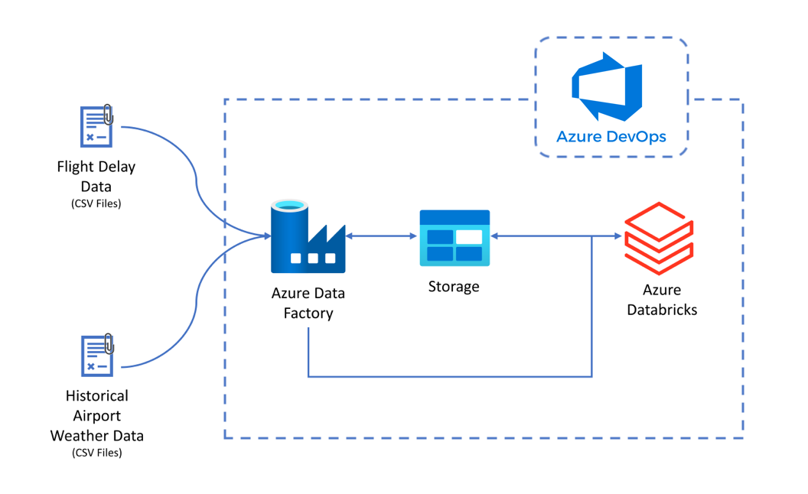

## Requirements

1. Microsoft Azure subscription must be pay-as-you-go or MSDN.
    - Trial subscriptions will not work.

2. Follow all the steps provided in [Before the Hands-on Lab](../quickstart/README.md)

	> Refer to the Before the hands-on lab setup guide manual before continuing to the lab exercises.

## **Exercise 1: Infrastructure As Code**

>**Duration**: *20 minutes*

In this exercise, you will explore and understand the structure and contents of the IaC folder, which contains all the scripts and templates necessary to correctly perform this and other exercises in this lab, using a best practices model.

### Technology Overview

#### Infrastructure As Code Practice

Infrastructure as Code (IaC) is the management of infrastructure (networks, virtual machines, load balancers, connection topology, and other cloud services) in a descriptive model, using the same versioning as DevOps team uses for source code. Like the principle that the same source code generates the same binary, an IaC model generates the same environment every time it is applied. IaC is a key DevOps practice and is used in conjunction with continuous delivery. [More information](https://docs.microsoft.com/en-us/devops/deliver/what-is-infrastructure-as-code)

#### Azure Resource Manager Templates

To implement infrastructure as code for your Azure solutions, one of the options is to use Azure Resource Manager templates (ARM templates). The template is a JavaScript Object Notation (JSON) file that defines infrastructure and configurations for your project. The template uses declarative syntax, which lets you state what you intend to deploy without having to write the sequence of programming commands to create it. In the template, you specify the resources to deploy and the properties for those resources. [More information](https://docs.microsoft.com/en-us/azure/azure-resource-manager/templates/overview)

### **Task 1: Understanding the IaC folder**

In this task you will explore and understand the folder structure, navigating through its scripts and templates for IaC execution.

To proceed with the execution of the other exercises below, you must understand the structure of the "infrastructure-as-code" folder.

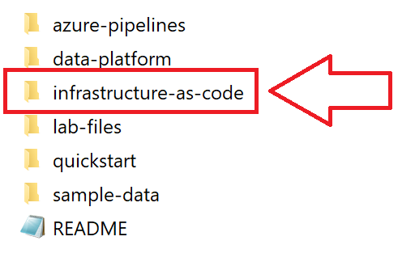

```
|infrastructure-as-code| ---> Main folder
	|databricks|
		|dev|
			interactive.json
		|prod|
			interactive.json
		|qa|
			interactive.json
		|sandbox|
			core.json
	|infrastructure| ---> Azure Resource Manager templates
		|linkedTemplates|
			|compute|
				template.json
			|data|
				template.json
			|ml|
				template.json
			|roleAssigments|
				compute.json
				data.json
		|parameters| ---> Azure Resource Manager templates parameters
			parameters.dev.json
			parameters.dev.template.json
			parameters.prod.json
			parameters.prod.template.json
			parameters.qa.json
			parameters.qa.template.json
		azuredeploy.json
	|scripts| ---> Script files that create our infrastrucure with help from ARM templates
		AcceptanceTest.ps1
		DatabricksClusters.ps1
		DatabricksSecrets.ps1
		Deploy.ps1
		Lint.ps1
		Plan.ps1
		PublishOutputs.ps1
		Sandbox.ps1
		Setup.ps1
		UploadSampleData.ps1
	|tests| ---> After of IaC execution, these scripts can validate the final IaC result, looking for issues on the resource creation process
		|Compute|
			Databricks.Tests.ps1
			DataFactory.Tests.ps1
			KeyVault.Tests.ps1
			ResourceGroup.Tests.ps1
			RoleAssigments.Tests.ps1
		|Data|
			DataLake.Tests.ps1
			ResourceGroup.Tests.ps1
	GitVersion.yml
```

#### **Folder [infrastructure]**

##### *File: azuredeploy.json*


Main template, with declared parameters, variables and resources. Here we use linkedTemplates.
>*NOTE*: We have the option of using separate parameter files as a good practice when using IaC templates, without the need to change directly in the main template.


#### **Folder: linkedTemplates**


In linkedTemplates we have templates with "parts" of declared resources that are not declared in the main Template, in order to reuse and can link with other templates.
>*NOTE*: linkedTemplates is a widely used practice, for better organization and handling of templates of different types of resources and being able to link them to any template.


#### **Sub-Folders and Files: linkedTemplates**


##### *File: template.json (subfolders 1, 2, 3)*

For each subfolder **(1, 2, 3)** we have this file "similar" to the `azuredeploy.json` file, but with the declaration being carried out only with the resources corresponding to the subfolder type, for example: subfolder compute, we have a template file `.json` with only compute-related resources declared which will link to the main template next (`azuredeploy.json`).

- **Computing resources:** Virtual machine, network interface, Public IP, Key Vault, Databricks, Data Factory
- **Data resources:** Data Lake Storage Account
- **ML resources:** Machine Learning Service and associated resources (Key Vault, Application Insights, Storage and Container Registry)

Example of an Azure Data Factory declaration in a template.


#### **File: compute.json, data.json (subfolder 4)**

For subfolder 4 we have two templates named `compute` and `data`, responsible and with declared instructions to apply and allow access to each resource to be created, correctly.

To apply a correct role and permission to a resource, Azure uses features from Azure Active Directory, such as Service Principal.

>**Azure AD Service Principal** is an identity created for usage with applications, hosted services, and automated tools that need access to Azure resources. This access is restricted by the roles assigned to the service principal, giving you control over which resources can be accessed and at which level. For security reasons, it's always recommended to use service principals with automated tools rather than allowing them to log in with a user identity. [More information](https://docs.microsoft.com/en-us/cli/azure/create-an-azure-service-principal-azure-cli)

Example of a resource declaration in this template.

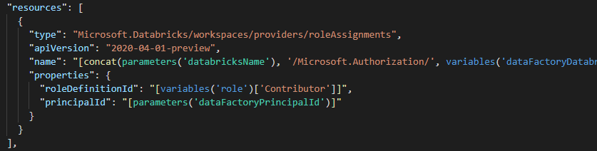


#### **Folder: parameters**

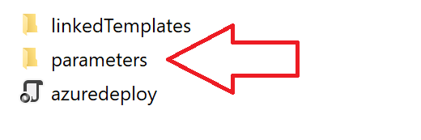

Parameters folder and directory with templates files with parameters and values to be used by linkedTemplates and main template, without the need to change directly in the main template.
>*NOTE*: Using templates parameters is optional and can be used directly in the main template. However, following a model of good practice, the use separately is indicated.

Example of a parameters declaration in this template.


#### **Folder [databricks]**

In this file you will find declared settings related to the Databricks resource which will be used in executing the scripts (below) and provisioning your infrastructure, as well as its necessary resources.

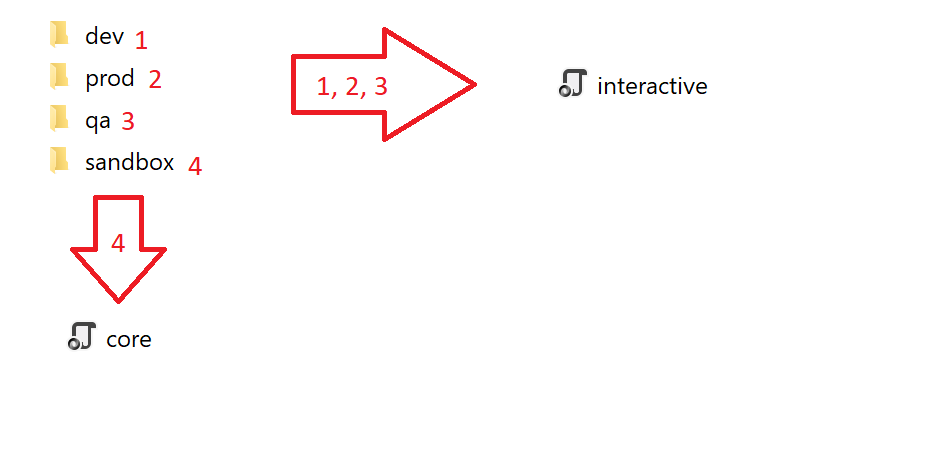

Example of a configuration declaration in this template.


#### **Folder [scripts]**

In this folder you'll find all the scripts responsible for executing and creating resources, along with the ARM templates.
Some scripts are referenced with ARM templates, "calling" them to perform some necessary steps for the correct creation of resources and infrastructure.

There is a correct order for these scripts execution to succeed, as described in **Exercise 3**, in the IaC CI/CD discussion.


#### **Folder [tests]**

After running using ARM templates, scripts and other configuration items and provisioning your infrastructure and resources, we must apply tests in order to validate if everything is ok.

These tests must be run through the scripts described below.

You can practice more on the testing topic in [Exercise 6: Testing](#exercise-6-testing).


### **Task 2: Checklist of IaC best practices**

In this task you will understand the best practices in creating, executing and managing scripts and templates in IaC.
Using a checklist to review what has been or will be executed is extremely important, with the objective of validating and verifying what may be "missing" in your environment and that is essential for use.

At each complete rerun of the steps, you should use this checklist described below to "check" each item/box you have already validated and is ok.
In case of failure in one of the steps below, go back and validate the necessary to proceed.

**NEVER "skip" a step in order to gain agility in the process. Each step is essential and important for you to have the most assertive environment possible and not have future problems :)**

Whenever possible, review the reference documents listed at the end of these task for use of resources through best practice.

1. [ ] Does this code correctly implement the Azure resources and their properties?
2. [ ] Are the names of Azure resources correctly parameterized for all environments?
3. [ ] Are all Azure resources being implemented in the correct modules (e.g. data, compute)?
4. [ ] Are there acceptance tests that cover the newly added code and do they pass in the CI/CD pipelines?
5. [ ] Do the tests for this code correctly test the code?
6. [ ] Is the code documented well?
7. [ ] Have secrets been stripped before committing?
8. [ ] Is PII and EUII treated correctly? In particular, make sure the code is not logging objects or strings that might contain PII (e.g. request headers).
9. [ ] Is the deployment of the code scripted such that it is repeatable and ideally declarative?
10. [ ] Is the PR a relatively small change? Optimal PR sizes for code reviews are typically described in terms like embodying less than three days of work or having [200 or fewer changed lines of code](https://smallbusinessprogramming.com/optimal-pull-request-size/). If not, suggest smaller user stories or more frequent PRs in the future to reduce the amount of code being reviewed in one PR.

### **Additional references**

* [Azure Resource Manager Templates - Best Practices Guide](https://github.com/Azure/azure-quickstart-templates/blob/master/1-CONTRIBUTION-GUIDE/best-practices.md)
* [The PowerShell Best Practices and Style Guide](https://github.com/PoshCode/PowerShellPracticeAndStyle)
* [Effective code Reviews](https://www.evoketechnologies.com/blog/code-review-checklist-perform-effective-code-reviews/)


## **Exercise 2: Git Workflow**

>**Duration**: *20 minutes*

### **Task 1: Understanding all folders**

This laboratory have a repository with different folders by component: Infraestructure as Code, Data Engineering, Azure Pipelines and others, in a real projects you will have git repositories by component.

The structure of folders that we have is:

```
<project-name>
│
└───azure-pipelines: CI/CD pipelines
    │
    └───adf
    │
    └───databricks
    │
    └───iac
    │      
    └───lib
│   
└───data-platform: Data Engineering
    │
    └───adf
    │
    └───notebooks
    │
    └───src
        │            
        └───bdd-adf-pipelines
        │            
        └───dataopslib         
│   
└───infrastructure-as-code: Infrastructure as Code
│   
└───labfiles: Step by Step guide of the Hands on Lab
│   
└───quickstart: Hands On Lab Before
│   
└───setup-data: Source of Data
```

Infrastructure as code and data engineering are treated as different scopes in terms of tools, languages and patterns. For this reason, the proposal is having dedicated repositories for these workstreams. Furthermore, a repository that consolidates all technical decisions across workstreams has been considered.


### **Task 2: Validate of the Environments**

We are working with three environments `dev`, `qa` and `prod`, and this environments are related with the branchs:

* The `main` branch has the stable version for the **Production** environment.
* The `qa` branch has the stable version for the **QA** environment.
* The `develop` branch has the stable version for the **Development** environment.
* The `feature` or `fix` branches have *preview* versions that will be reviewed by code reviewers through the Pull Request process before merging into the `develop` branch.

<br/>

>**Setting Azure Devops Project:** before starting to execute the pipelines and the git workflow, check the environments in Azure Devops for the IaC and Databricks. If anyone is missing you can create inside the Pipelines menu of Azure DevOps.


>**Note**: All enviornments was created on the quickstart scripts. For instance the environments needs for the lab is: `dev`, `qa`, `prod`, `databricks-dev`, `databricks-qa` and `databricks-prod`. All of then must exists in Azure Devops before making any Pull Request (PR).
    


### **Task 3: Git workflow**

Version control has a general workflow that most developers use when writing code and sharing it with the team.

These steps are:

1. Get a local copy of code if they don't have one yet.
2. Make changes to code to fix bugs or add new features.
3. Once the code is ready, make it available for review by your team.
4. Once the code is reviewed, merge it into the team's shared codebase.

<br/>

#### **Infrastructure as code**

On this lab, we've used the following git workflow for promoting IaC code to production.

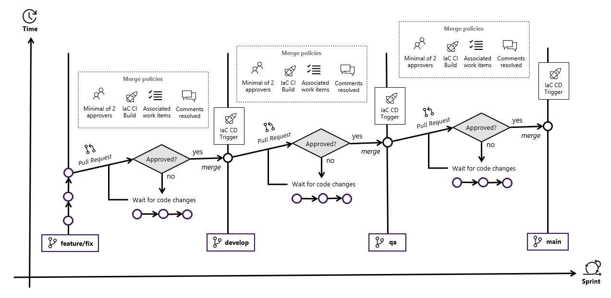

<br/>

#### **Data Engineering git workflow**

Data Engineering has two independent workflows:

* Databricks Notebooks
* PySpark Library

<br/>

##### **Databricks Notebooks**

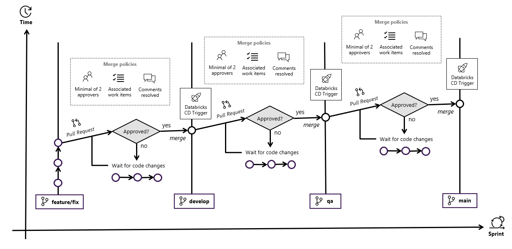

<br/>

##### **Library**


<br/>

#### **Naming conventions for branches and commits**


Convention of prefixes for commit messages:

* **docs:** Used for creating or updating content of documents.
* **style:** Used for updating a style in a document (e.g. replacing a Markdown list by a table, creation of headers).
* **feat | feature**: Used for creating a new features in the code.
* **fix:** Used for fixing bugs on the code, as well as fixing typos or content in general on documents.
* **test:** Used for creating new tests (e.g. unit tests, integration tests).
* **refactor:** Used for refactoring code without introducing new features or fixing bugs.
* **chore:** Used for modifying things that are not related to code or documentation (e.g. changing the name of a folder or directory, adding ignore files on .gitignore, deleting old files).

#### **Release lifecycle strategy**

**Predictability** is key to the success of an agile project, because it allows you to deliver business value with *frequency* and *consistency*. Predictable delivery helps build trust and is likely to lead to better results for customers and more autonomy for the team.

The proposal is to use a **Production-first** strategy, where one of the *definition of done* requirements of a *user story* is to have all the artifacts in the **production** environment.


## **Exercise 3: CI/CD Pipeline IaC**

>**Duration**: *20 minutes*

### **Task 1: Executing CI/CD Pipeline IaC**

Now we will start to work with the pipelines and understand the funcionality that these have.  After completing the [quickstart](../quickstart/README.md) step, make sure the CI/CD pipelines already exists in Azure DevOps.

>**Note**: `dataops` word as part of the name is the alias that you assign to the project.


In the quickstart the process create the pipelines to IaC, the customized library dataops, databricks and azure data factory.  Now we will see the IaC pipelines.


>**Note**: `dataops` word as part of the name is the alias that you assign to the project.

**CI Pipeline:** This pipeline is responsible for creating ARM templates that will be used in the CD pipeline to deploy resources in differents resource groups per environment.

##### **Execute CI Pipeline:** 


This pipeline was executed manually, but it has been configurated in the branch policies to start automatically if changes are made in the folder `infrastructure-as-code`:


##### **Execute CD Pipeline**: 


The CD pipeline will be triggered automatically after the CI Pipeline. After executing the IaC CD, check your Azure Devops environments to see how it changes. When this pipeline finishes its execution, also validate if you see the Azure resources created in the resource groups of the development environment.


>**Note**: Name of the Resource Groups and Resources depends on the custom alias defined by yourself and also the suscription id.

With these resources created, you can configure a secrets scope in databricks, for secure management of secrets.

##### **Databricks Secrets Scope**

When you have the resources created in the environment, it is time to configure the scope secrets in databricks, to do that, run the PowerShell script located at infrastructure-as-code/scripts to create the Databricks secrets scope for each environment:

You should to change `Key Valt Name` with your information and execute this script, and how the resources in development environment were created then we can create the scope in databricks dev.

```
./infrastructure-as-code/scripts/DatabricksScopeCreation.ps1 -KeyVaultName "<keyvault_name>" -ComputeResourceGroup "<compute_resource_group>" -DatabricksName "<databricks_name>" 
```

>**Note 1**: If you get the error msg about `Error 403 User not authorized` open the Databricks Workbench page using the same user due first access profile creation and then just run the script again.

>**Note 2**: To see Key names in secret scope dataops execute the follow command.

```
databricks secrets list --scope dataops
```


### **Task 2: Exploring Azure Data Services**

In this task, you will explore the main resources that have been deployed in your Azure Subscription.

The resource groups rerg-dataops-data-dev and rg-dataops-compute-dev contain data and compute services respectively.  

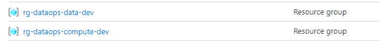

The rg-dataops-data resource group contains a [Data Lake Storage](https://docs.microsoft.com/en-us/azure/storage/blobs/data-lake-storage-introduction) and a [Blob Storage](https://docs.microsoft.com/en-us/azure/storage/blobs/storage-blobs-overview) 


The resource group rg-dataops-compute contains an instance of [Azure Data Factory](https://docs.microsoft.com/en-us/azure/data-factory/) and [Azure Databricks](https://docs.microsoft.com/en-us/azure/databricks/)


#### **Technology Overview**

Azure Databricks and Azure Data Lake enable modern data architectures simplifying and accelerating the data processing at any scale.

Azure Data Factory loads raw data into Azure Blob Storage and Azure Databricks processes the data and organize it into layers: landing, refined, trusted

Azure Delta Lake forms the curated layer of the data lake. It stores the refined data in an open-source format

### **Task 3: Explore Azure Blob Storage**

In this task, you will explore the Azure Blob Storage instance. 

1. Open the Azure Portal and navigate to the rg-dataops-data resource group and select the stgdataopseastus2dev Azure Blob Storage. 

2. On the overview blade, select Containers

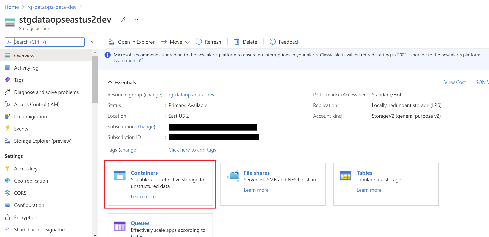

3. Select and open the flights-data container.

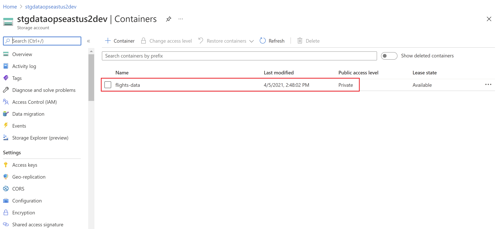

4. Review the CSV files. Select the CSV file and download it. 


## **Exercise 4: CI/CD Pipelines to Lib, Databricks and Data Factory**

>**Duration**: *60 minutes*

### **Task 1: Executing CI/CD Pipeline Lib**

Now, we need to create the custom library that we use in the notebooks of databricks, then we have the CI and CD Pipeline for the lib.  When these pipelines finished the execution, you could see the artifact in the feed `lib-packages` that you create in the [step 3 of the quickstart](../quickstart/docs/3a-azdo-setup-basic.md).

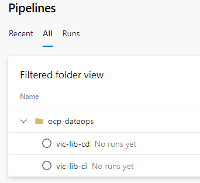

>**Note**: `vic` word as part of the name is the alias that you assign to the project.

### **CI Pipeline**

Execute the CI pipeline of the library to create the version `alpha` of the library.


When this pipeline finished in artifacts you can see the version.


>**Note**: The number in the version is variable depends of the Build Id.

### **CD Pipeline**

In the CD Pipeline you can to see the different stages by environment, we will to execute the CD Pipeline to left the version `beta` enable to be used in the databricks notebook.

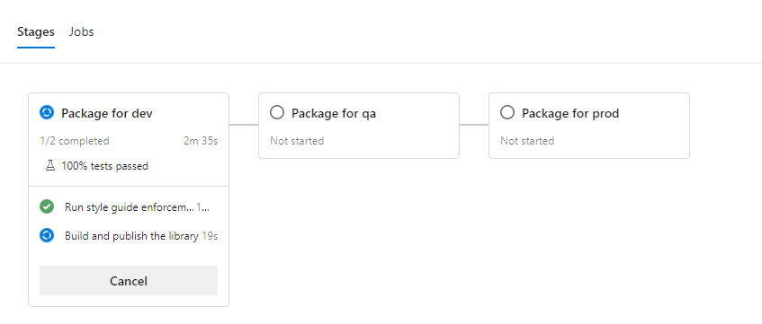

When this pipeline finished in artifacts you can see the version.

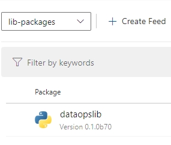

>**Note**: The number in the version is variable depends of the Build Id.

### **Task 2: Executing CI/CD Pipeline Databricks**

Now you could see the pipelines that work with databricks in the aspect of the custom library and the notebooks that will be executed in databricks.


### **CI Pipeline**

This pipeline make the check of the notebooks in databricks.


### **CD Pipeline Lib to Databricks**

This pipeline upload the current version library to the `dbfs` of databriks.


You could see in the environments that the status in `databricks-dev` changed.


### **CD Pipeline Notebooks to Databricks**

This pipeline upload the current notebooks to the shared folder in databricks.


You could see in the environments that the status in `databricks-dev` changed.


### **Task 3: Executing CI/CD Pipeline Azure Data Factory**

This pipeline check the integrity on the data and trigger the ADF Pipeline identifying some problems in it but this process doesnt wait that this pipeline finished.


>**Note**: The first time that this pipeline is executed it fails, because it is necessary that ADF pipeline finished sucessful the first time to create some folders in the container in the datalake that are necessaries to check the integrity of the data.

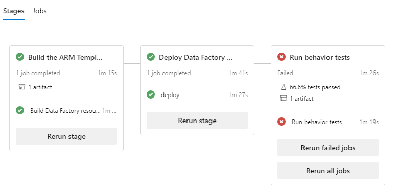

When the ADF Pipeline finished, you could execute again this CD Pipeline. you can check it, open ADF resource in the Azure Portal, and the in monitor the pipeline running.


Now that you understand the workflow, you can start with the other environments, and when the pipeline in ADF finished you can run again the pipeline to get the sucessful execution.

### **Task 4: Exploring Azure Databricks**

In this task, you will explore the Azure Databricks instance dbw-dataops-eastus2-dev. This resource contains notebooks with code to prepare and clean the data. 

1. Navigate to the Azure Databricks instance `dbw-dataops-eastus2-dev` and Launch the Workspace. 

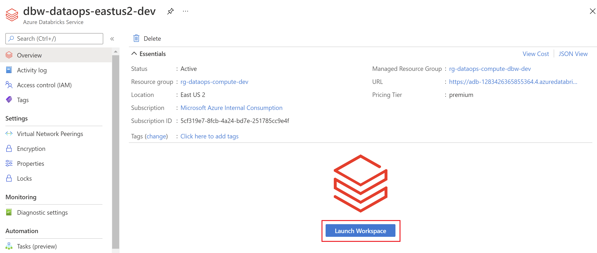

2. Navigate to the Workspace hub (2). Open the folders shared with you (if someone share with you the databricks instance) or seek your user in Users (3). Open the DataOps Folder (4) and select the notebook named 01 ADLS Mount (5).  


3. To run the notebook you need attach a cluster from the list (1) or create a new one if you don't have clusters deployed. 


3.1 Provide a name for the new cluster, establish the cluster setting and select Create Cluster.

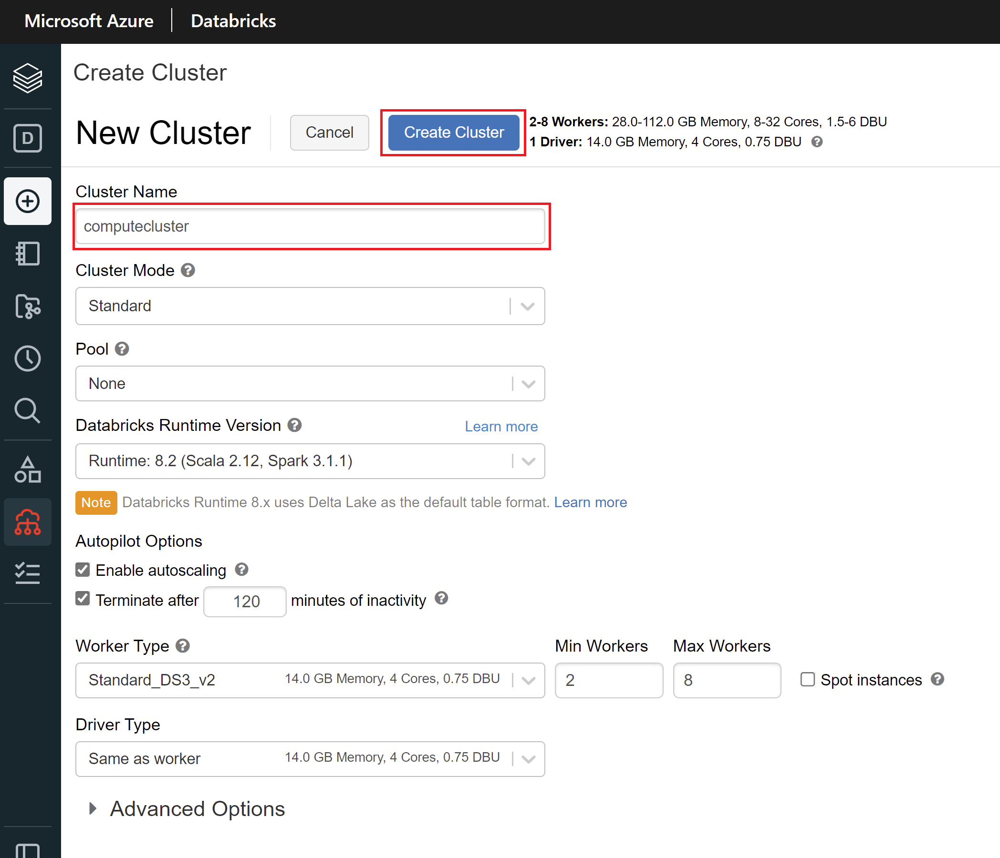

3.2 Navigate back to the notebook named 01 ADLS Mount and attach the cluster


4. Select Run Cell or Crt + Enter to run the cell and amount the Azure Data Lake. 
This code is to mount the Azure Data Lake Storage Gen2 account to Databricks File System. For the authentication, it uses Key Vault and OAuth 2.0.

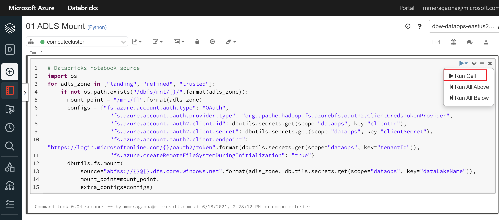  

5. Navigate back to the notebook named `02 One Notebook to Rule Them All`.

5.1 Run the cells to import the libraries that you will use to process and transform the data.

  

5.2 Read the file `FlightDelaysWithAirportCodes.csv` from the landing layer (1), transform the data (2), and create the a local table called flight_delays_with_airport_codes from the flight_delays_df Dataframe (3).  

 

5.3 Select clean columns to generate clean data (1) and save the clean data as a global table called flight_delays_clean (2). 

 

5.4 To see the created table: Click Data in the sidebar (1). In the databases folder, click on the default database (2). Open Tables Folder and Click the table name.  

 

5.5 Navigate back to the notebook. Run cells 9, 10 and 11 to prepare the weather data. Cell 9 reads raw data from landing layer and create a local table called flight_weather_with_airport_code. Cell 10 transforms data and Cell 11 creates a global table called flight_weather_clean.

 

5.5 Run the rest of cells. Cell 14 copies clean data of flight dealys and weather into the trusted layer of the data lake (1). Cell 16 saves data of airports with the delayes into the logs folder as CSV file (trusted layer) (2). Finally,the path of the CSV file will be the notebook output (3).

 

### **Task 5: Explore Azure Data Lake Storage**

In this task, you will explore the layers defined to organize the data into the Data Lake. The landing layer is for raw ingestion, and trusted layer is for the filtered and cleaned data.  

1. Open the Azure Portal and navigate to the `rg-dataops-data` resoruce group and select the Azure Data Lake instance `lakedataopseastus2dev`. 

2. On the Overview blade, select Containers


3. Select and open the landing layer container.


4. Select and open the directories airport-metada, flight-delays, flight-weather. They will contain CSV files with the infomation about airports, flights and weather. 


### **Task 6: Azure Data Factory**

In this task, you will explore the `adf-dataops-eastus2-dev` Azure Data Factory instance. 

1. Navigate to the `adf-dataops-eastus2-dev` Azure Data Factory instance and launch the workspace (Author & Monitor). 


2. Navigate to the Author hub.


3. You will find the pipeline `ProcessFlightDelaysData` and 6 datasets. The pipeline contains the activities to copy data from the XXXXXXXSource datasets into the XXXXXXSink datasets.


4. Open the pipeline `ProcessFlightDelaysData` and review the settings of the activities:
- Copy Airport Codes Data
- Copy Flights Delays  Data
- Copy Flights Weather Data
- Mount ADLS
- Transform Flights Data


4.1. Select the Copy Airport Codes Data (1). Select the Source Tab (2) and Click on Open to see the settings of the AirportCodesSource dataset (3).


4.2  Select Edit to review the Azure blob Storage linked service (1). View the file path that you want to copy (2). Select Browse to navigate into the `stgdataopseastus2dev` Azure Blob Storage instance (3) and Select the file path.  


4.3 Navigate back to the Copy Airport Codes Data Activity in the pipeline ProcessFlightDelaysData. Select the Sink tab (1) and Click on Open to see the setting of the AirportCodesSink dataset (2).


4.4. Select Edit to review the Azure Data Lake linked service (1). View the layer  where you will copy the data (2). Select Browse to navigate into the lakedataopseastus2dev Azure Data Lake instance (3) and select the  layer (4).  


5. Repeat the steps 4.1 - 4.4 for the Copy Flights Delays Data and Copy Flights Weather Data activities.

6. Navigate back to the pipeline and select the notebook activity `Mount ADLS`. Select the Azure Databricks tab (1) and click on Edit to view the settings of the linked service of the Databricks instance.


7. Select the settings tab of the notebook activity to configure the notebook to run in the databricks instance (1). In the Notebook path, indicate the path of the notebook to run (2). Select Browse if you want to explore the available notebooks (3) and explore the available folders in the Databricks instance (4). Select Open to open the Databricks workspace. 

8. Repeat the steps 6 and 7 to explore the Notebook Activity Transform Flight Data. 


9. OPTIONAL - Navigate back to the pipeline and run it. 


9.1 Navigate to the Data Lake. Follow the file path that you indicated in the step 4.4. You will find the CSV file just copied. 


>**Note:** If you arrive here you have the environment of dev deploy sucessful, now the idea is to see in detail more about the Lib and the tests.

## **Exercise 5: Semantic Versioning of Data Engineering Libraries**

>**Duration**: *20 minutes*

In the DataOps culture, the data engineer team moves at lightning speed using highly optimized methodology, tools, and processes. One of the most important productivity methodologies is the ability to reuse codes. When we talk about reusing code, we mean about the approach to reuse data engineering codes that are responsible to do default data transformations for your data sets. 

When we talk about data engineering approach in a data analytics project, automatically we think about [Notebooks](https://en.wikipedia.org/wiki/Notebook_interface). Use notebooks is good to analyze, make experimentations and apply techniques of curate data in the pipelines. However oftentimes in a project it can become a manually task, as a copy and paste codes across notebooks.  To address necessities like this, optimize the processes and save the time, we can develop custom libraries to abstract these data engineering practices, and use them around the notebooks.

In this task you will learn how to implement a semantic versioning using a custom library in Python.

### **Task 1: Exploring the Databricks Notebook**

Open the **02 One Notebook to Rule them all** notebook (located in the Workspace Databricks, under Notebook’s area) and run it step by step to complete this first step. Some of the most important tasks you will perform are:

* Install and import a custom python library
* Prepare and apply data quality in the flight delays and whether data sets.
* Transform and combining dates columns between flights delay and whether forecast data set using the custom python library

  

>**IMPORTANT NOTE**
_Please note that each of these tasks will be addressed through several cells in the notebook. You don’t need to change them only execute and analyze the transformation operations._

### **Task 2: Exploring the Python custom libraries**

In previous task we explored the databricks notebook, and we used a custom library responsible for the main transformations in the data sets of flights delays and whether. Now, let’s to explore and understand some approaches to creating custom libraries in data analytics projects.

>**IMPORTANT NOTE**
_Please note that we will use existing custom libraries in the repository, won’t be necessary to develop a new library to this exercise._

**For the remainder of this guide, the following pre-requirements will be necessary to execute and validate the library locally:**

*	Python 3.x
*	Docker + Docker Compose
*	Java SDK
*	Visual Studio Code

1. Open the HOL directory in your prompt and execute **“code .”**  to open the Visual Studio Code:

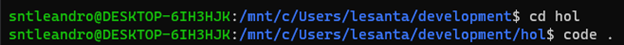  

2. From the left explorer view, open the **“data-platform/src/dataopslib/dataopslib””** directory structure. 

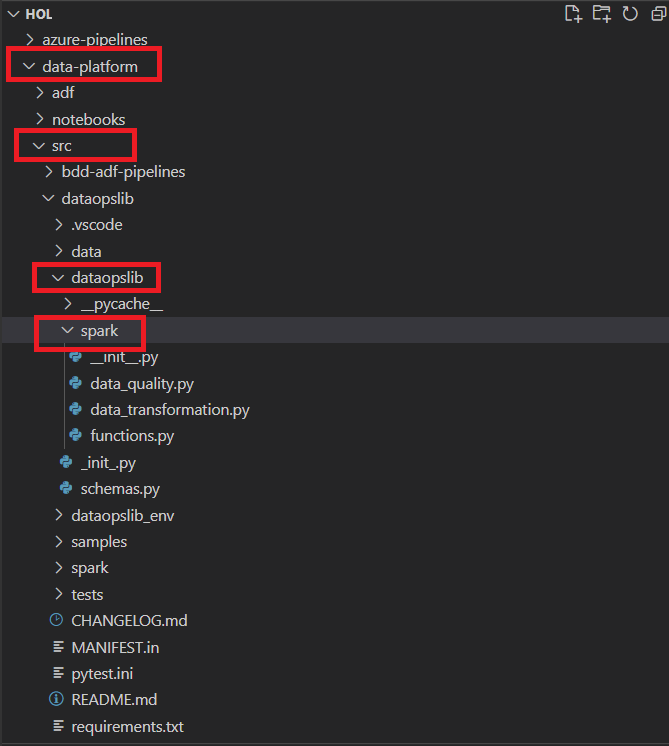  

3. Inside the structure you will see the codes used for the development of libraries that are current used in the databricks notebook. 
For that, open the **“spark”** directory and click on the file **“data_transformation.py”**

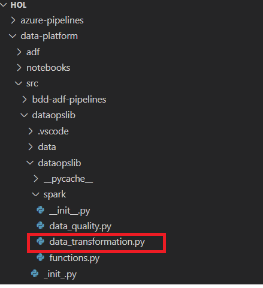

4. If you look in the code library, will notice that there is a lot of functions that is used in the databricks notebooks to address data cleanings and transformations. Let’s look at one of them. Press *CTRL+F* type **“make_datetime_column”** and click OK. You will see that in this part of the code, we are using is a pretty common practice for some datasets:

```
def make_datetime_column(df: DataFrame, columnName: str, year: str, month: str, day: str,
                         hour: Union[str, None] = None, minute: Union[str, None] = None,
                         second: Union[str, None] = None, time: [str, None] = None,
                         timeFormat: str = 'HH:mm:ss') -> DataFrame:
    """Buils a new `Timestamp` column based on string columns containing each of the parts of the date. If time-related columns are indicated,
    time is constructed based on local time zone. If not, a `DateTime` column is constructed. Missing values are rounded down to the minute/hour.

    Parameters
    ----------
    df : DataFrame
        The dataframe where the data is contained
    columnName : str
        the column to build
    year : str
        Column containing the year
    month : str
        Column containing the month
    day : str
        Column containing the day
    hour : Union[str, None], optional
        Column containing the hour, by default None
    minute : Union[str, None], optional
        Column containing the minute, by default None
    second : Union[str, None], optional
        Column containing the second, by default None
    time: Union[str, None], optional
        Column containing the time part to construct the date column. This argument can't be combined with `hour`/`minute`/`second`
    timeFormat: str, optional
        When `time` is indicated, `timeFormat` represents the format where time column is stored, by default 'HH:mm:ss'
    Returns
    -------
    DataFrame
        The dataframe with the new column appended.
    """
    if timeFormat and not time:
        raise ValueError("You can't specify timeFormat if time is missing.")
    if time and (hour or minute or second):
        raise ValueError("You can't specify both time and hour/minute/second. Either use one or the others")
    if not second:
        logger.info("Seconds not specified. Minutes will be rounded down")
        second = f.lit("00")
    if not minute:
        logger.info("Minutes not specified. Hours will be rounded down")
        minute = f.lit("00")

    if not (hour or time):
        logger.info(f"Building a date column from columns '{year}', '{month}' and '{day}'")
        return parse_to_date_column(concat_columns(df, columnName, year, month, day, union_char='-'), columnName, 'yyyy-M-d')
    else:
        logger.info('Building a datetime column from columns {}'.format([year, month, day, hour, minute, second, time]))
        df = concat_columns(df, '__date_part', year, month, day, union_char='-')
        if not time:
            df = concat_columns(df, '__time_part', hour, minute, second, union_char=':')
        else:
            df = parse_to_time_column(df, time, timeFormat, '__time_part')

        df = concat_columns(df, columnName, '__date_part', '__time_part', union_char=' ')
        df = parse_to_datetime_column(df, columnName, 'yyyy-M-d HH:mm:ss', columnName)
        df = drop_columns(df, '__date_part', '__time_part')

        return df
```


5.	From the left menu explorer, you will see others library, but before to execute and test them locally you will need to setup the configuration of the environment. For that, follow the steps **6** and **7**.


6. Open **data_platform/src/dataopslib** create a virtual environment and install the required packages:

    ```sh
      python3 -m venv dataopslib_env
      source dataopslib_env/bin/activate

	  code . 
	  
      pip3 install wheel
      pip3 install -r requirements.txt
    ```

7. Open **data_platform/src/spark** folder on your terminal and run the Docker compose to start an Apache Spark instance locally:

    ```sh
       docker-compose up
    ```


8. Now we already have the environment prepared and to start the execution of some existing libraries. Choose more one sample to test, open the samples folder, click on the file **“sample_read_csv.py”** and press F5.

  


10. Until we were able to abstract certain functions inside a library and reuse them in the notebooks. But now, let’s imagine that we need to create a new feature for this library, or maybe fix a bug, how to versioning this code? Let's to learn that in the next exercise.

### **Task 3: The Git Workflow for Data Engineering**

In the [Exercise 2](#exercise-2-git-workflow) we saw about the Data Engineering git workflow, which basically has two independent workflows:  **Databricks Notebooks** and **Library**. The two are very closely related, but as our purpose here is to learn more about how this semantic versioning approach for custom libraries works, let’s into a little bit deeper  to understand first how the library workflows. 

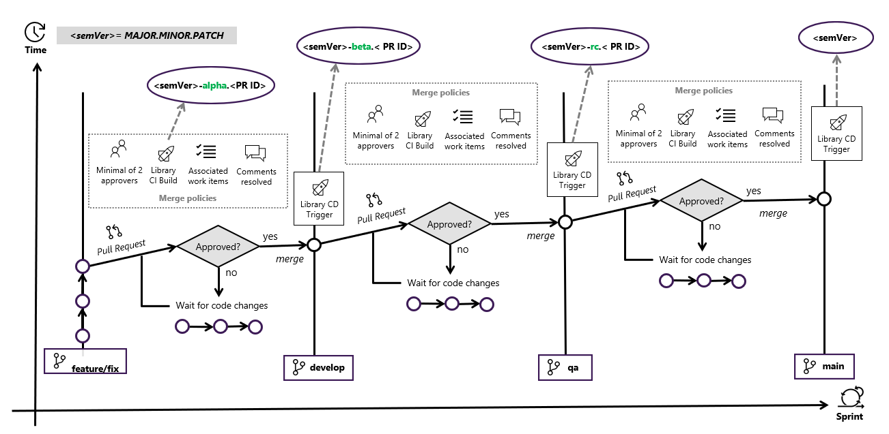  

The first thing that we need to understand looking to the picture above is that we are considering the best practices of Software Engineering for our practices of Data Engineering. We need to have in our mind that libraries for data engineering have also a specify lifecycle, because the data engineers also are working for introducing new capabilities for theses libraries and because of that it’s important to have a good versioning strategy. For those who has more familiarity with software versioning concept and knows the terms MAJOR MINOR and PATH it is a similar approach, but for those who doesn’t know, take look to a simple summary about it.


    
* **Patch Version:** are exchangeable, meaning notebooks and environments consumers can upgrade or downgrade freely.
    * **Example:** Bug fix, Performance improvement, environment, or internal tweaks.
	* **Policy:** Notebooks or Spark clusters should have this library updated to improve the utilization in a specific situation.
	* **
* **Minor Version:** are backward compatible, notebooks and environments consumers can upgrade freely.
    * **Example:** New features.
	* **Policy:** Update the notebooks, jobs, or environment to get some new functions. Nothing will break
	* **
* **Major Version:** means a complete refactoring on the package and the change breaking backward compatibility.
    * **Example:** Change a transformation function or removed an old function and replace by new one.
	* **Policy:** Test all environments or notebooks post update.
	* **

These definition can be done using a lot of different ways, but here we are considering a combination of these three **<semVer=MAJOR.MINOR.PATCH>** into three different prefixes such as ***Alpha Version(a)***, ***Beta Version(b)*** and ***Release Candidate Version(RC).***


>. In the **Azure DevOps Portal**, open the **Artifacts** and click in **dataopslib**. 

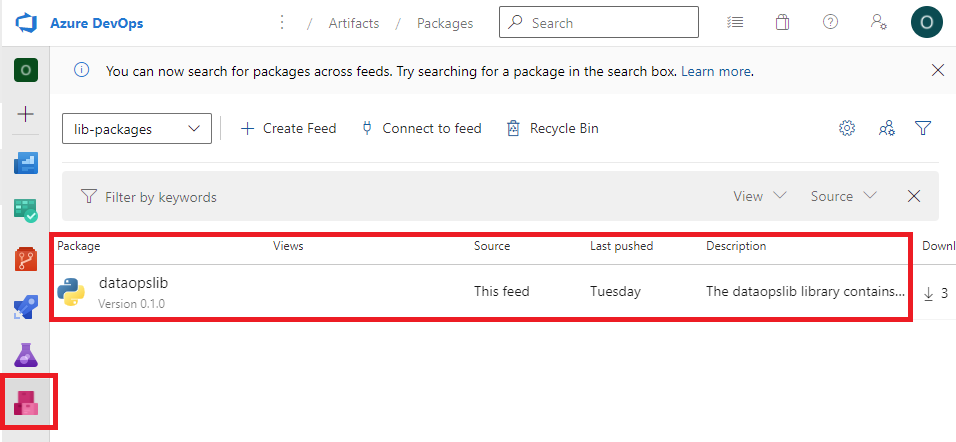  

>2. In **Overview**, you can analyze the main information’s of the library that you explored in the previous task. 

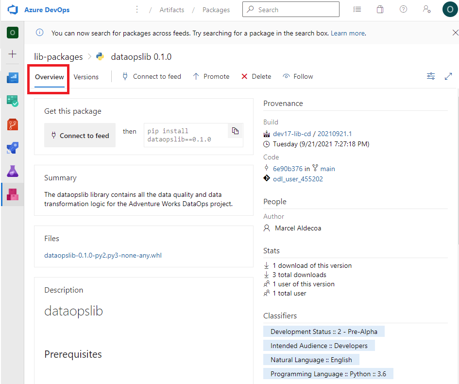 


>3. Clicking in **versions** you can check the list of the previous version. We can noticed that the currently version in the pipeline, already was a ***Alpha Version(a)*** **(0.1.0a5, 0.1.0a14, 0.1.a23)**, also after this become a ***Beta Version(b)*** **(0.1.0b6)** and subsequently a ***Release Candidate(r)*** **(0.1.0rc15)** until be deployment in production **(0.1.0).**  

 

The git flow for this solution begins with the pull request to of this change the ***develop branch***, it automatically will generate what we are calling ***Alpha Version***. This Alpha version will pass to the **Library CI Builds** to do automatized tests, once it is approved there is more one’s checklists to proceed and do the merge in develop branch, when it occurs the CD Trigger will generate the **Beta version id** into the development environment. Repeating the same process to the QA branch, it will generate a ***Release Candidate (RC)*** that can be used after to deploy this change in the production. 


### **Task 4: Code Review Checklist: Data Engineering**

#### **Custom Library**

1. [ ] Does this code correctly implement the business logic?
2. [ ] Is this code designed to be testable?
3. [ ] Does each method or function "do one thing well"? Reviewers should recommend when methods could be split up for maintainability and testability.
4. [ ] Are there unit tests that cover the newly added code and do they pass in the CI/CD pipelines?
5. [ ] Do the tests for this code correctly test the code?
6. [ ] Do unit tests mock dependencies so only the method under test is being executed?
7. [ ] Is the code documented well?
8. [ ] Have secrets been stripped before committing?
9. [ ] Is PII and EUII treated correctly? In particular, make sure the code is not logging objects or strings that might contain PII (e.g. request headers).
10. [ ] Is the deployment of the code scripted such that it is repeatable and ideally declarative?
11. [ ] Is the PR a relatively small change? Optimal PR sizes for code reviews are typically described in terms like embodying less than three days of work or having [200 or fewer changed lines of code](https://smallbusinessprogramming.com/optimal-pull-request-size/). If not, suggest smaller user stories or more frequent PRs in the future to reduce the amount of code being reviewed in one PR.

#### **Databricks Notebooks**

1. [ ] Does the notebook correctly implement the business logic?
2. [ ] Is each step of the notebook "doing one thing well"? Reviewers should recommend when steps could be split up for maintainability.
3. [ ] Does the notebook leverage the custom library for data transformation?
4. [ ] Is the notebook documented well?
5. [ ] Have secrets been stripped before committing?
6. [ ] Is PII and EUII treated correctly? In particular, make sure the code is not logging objects or strings that might contain PII (e.g. request headers).

## **Exercise 6: Testing**

>**Duration**: *20 minutes*

### **Task 1: Understanding test types**

Testing data pipelines has unique challenges that makes it different from testing traditional software. You have data pipelines that pulls data from many source systems, ensure data quality (i.e. ensure that bad data is identified, then blocked, scrubbed, fixed, or just logged), combines this data, transforms and scrubs it. Then the data is stored in some processed state for consumption by downstream systems, analytics platforms, or data scientists. These pipelines often process data from *hundreds* or even *thousands* of sources. You run your pipelines and get *several* million new rows in your consumption layer.

Then you create full end-to-end functional tests for the pipelines. The pipelines are getting more complex over time, and the tests are becoming harder to understand and maintain. Then you start thinking:

* How to make the tests as readable as possible?
* How to improve tests maintainability?
* *How to effectively communicate the **current behavior** of the data pipelines with the team or across teams?*

Leveraging the concepts of `Behavior-Driven Development` (BDD) could be the answer for these questions. BDD uses **human-readable** descriptions of software user requirements as the basis for software tests, where we define a shared vocabulary between stakeholders, domain experts, and engineers. This process involves the definition of entities, events, and outputs that the users care about, and giving them names that everybody can agree on.

**Testing Strategy**

*Language and Frameworks*

Data engineers and data scientists are turning decisively to Python - according to the [O'Reilly annual usage analysis](https://www.oreilly.com/radar/oreilly-2020-platform-analysis/) - due to its applicability and its tools for data analysis and ML/AI.

For this reason, the tests in this repository are written in Python using the most used open-source BDD framework called [behave](https://github.com/behave/behave). The framework leverages the use of [Gherkin](https://cucumber.io/docs/gherkin/reference/) to write tests, a well-known language used in BDD designed to be human readable.

*Structure of tests*

Essentially the test files are structured in two levels:

* **Features**: Files where we specify the expected behavior of the data pipelines based on the existing requirements that can be understood by all people involved (e.g. data engineers, data scientists, business analysts). The specifications are written in Gherkin format.
* **Steps**: Files where we implement the scenarios defined on feature files. These files are written in Python.

>On the next Task of this lab, you will explore an example that it is already implemented as part of the full solution deployment. (See Exercise 4)

### **Task 2: Understanding BDD tests**

>**Prerequiste for this task:** Succesful completion of Excersise 4

**Objective of this Task:** Review how a Pipeline test was configured and explore the results of the BDD execution.

First review how the DevOps pipeline was defined:

1. Go to the repositoy that was created as part the Quickstart and open the templates folder, were you will see 3 yml files.

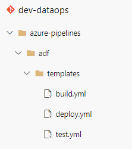

2. Open the test.yml file by clicking on it

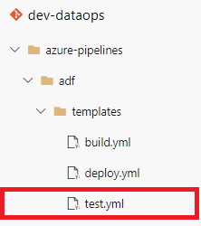

3. Indentify the script activity that runs the behave modulo and identify the different paramentes that are set before it is called


Now lets review the DevOps pipeline execution results:
  
1. Go to DevOps Pipelines from the project defined on Execise 4 and select the Pipeline with the name "*\<your lab prefix>*-adf-cd" by clicking on it.

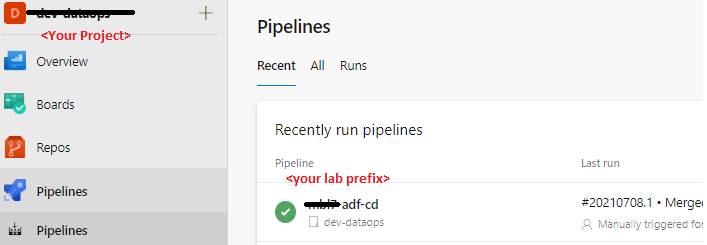 

2. You will see a list of resent runs of the selected pipeline, click on the lates run

3. At the stages secction select the "Run behavior tests" stage

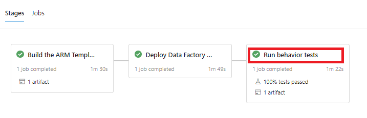 
  
4. Review the Azure DevOps execution results for "Run behavior tests"\\"TEST: Run behave features"

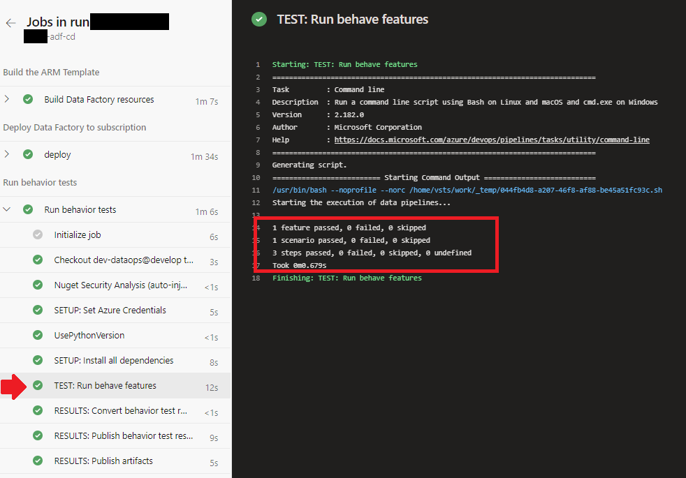

<p>Here you see the results of running the BDD test using <b>behave</b></p>

> On the next optional task you could explore how to build your own Data Pipeline BDD test

### **Task 3: Developing a new test**
>**This Task is Optional**. It's objective is to get you familiarize on how Behave works and how it can be used to test Pipeline execution results.

**Pre-requisits:** Have an environment to run Python 3.4+, either on your local host or on a Virtual Machine like the "Data Sience Windows VM" on Azure.

Follow the instructions indicated [here](../data-platform/src/bdd-adf-pipelines/README.md#motivation). After completion return to this page to continue with the lab.

## **Exercise 7: Deploying QA and Prod Environments**

>**Duration**: *20 minutes*

When the all pipelines were executed in development branch and you validate the behavior, you can start to execution of the git workflow  doing Pull Request, remember create the scope in databricks by each environment.

### **Task 1: Promote Develop to QA**

Open a PR from `develop` to `qa` to promote the code changes to the QA environment. Please wait again for the creation of the QA infrastructure.


>**Note**: It will be necessary modify branch policies to make the merge only with one reviewer and it can be the owner, click check `Allow requestors to approve their own changes` (only for the laboratory). 


When you make the merge you could be that the CI Pipeline of IaC start automatically.


>**Note:** Remember to **[configure the scope in Databricks for qa environment](#databricks-secrets-scope)** and run the pipeline of Lib for `qa` environment.


### **Task 2: Promote QA to Prod**

Repeat the process one last time, opening a **PR** from `qa` to `main` to promote the code changes to the **PROD environment**. Please wait again for the creation of the PROD infrastructure.  In artifact you can see the final version of the library for production.


### Additional references

* [PEP 8: Style Guide for Python Code](https://www.python.org/dev/peps/pep-0008/)
* [Python Best Practices Guide](https://gist.github.com/sloria/7001839)
* [Effective code Reviews](https://www.evoketechnologies.com/blog/code-review-checklist-perform-effective-code-reviews/)

<br/>

>**Congratulations** right now you finished the Hands On Lab DevSquad in a Day.