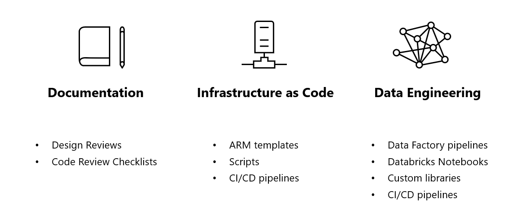

- [Exercise 3: Git Workflow and CI/CD](#Exercise-3-Git-Workflow-and-CI/CD) (45 min) (Owner: Ana/Adrian)
  - [Task 1: Understanding all repositories]()
      # Git Repositories 
      ## Overview/Problem Statement

      This documentation contains the definition of the structure of folders that the laboratory has, but in a real projects you will have Git repositories for Infrastructure as Code, Data Engineering, Azure Pipelines and Documentation.

      ## Goals/In-Scope

      * Define the structure of repositories for infrastructure as code, data engineering and documentation in order to improve the management of DataOps assets.
      * Define what are the types of assets expected on each repository.

      ## Non-goals / Out-of-Scope

      * Source code on the repositories.

      ## Proposed Design

      The proposed design is guided by a [component approach](https://en.wikipedia.org/wiki/Component-based_software_engineering), with the principle that assets in a repository must be semantically related. In other words, a git repo must be *modular* and *cohesive*.

      Infrastructure as code and data engineering are treated as different scopes in terms of tools, languages and patterns. For this reason, the proposal is having dedicated repositories for these workstreams. Furthermore, a repository that consolidates all technical decisions across workstreams has been considered.

      

      In our laboratory, we have this structure of folders (Simulating Repositories):
      ```
      <project-name>
      │
      └───azure-pipelines: CI/CD pipelines
      │   
      └───data-platform: Data Engineering (Detail in Exercise 4 and 5)
      │   
      └───infrastructure-as-code: Infrastructure as Code (Detail in Exercise 2)
      │   
      └───labfiles: Step by Step guide of the Hands on Lab
      │   
      └───quickstart: Hands On Lab Before
      │   
      └───setup-data: Source of Data
      ```

      ### Benefits

      * Simplified repositories with a clear scope defined is easier to maintain, collaborate and navigate across assets.
      * Splitting repos give us the flexibility to have independent git workflows for infrastructure as code, data engineering and documentation.

      ### Drawbacks

      * Additional complexity to manage branches and its policies.

      ### Technologies

      * Git

      ### Additional references

      * [Component-based software engineering](https://en.wikipedia.org/wiki/Component-based_software_engineering)

      <br/><br/>
      
      # Git Workflow for Infrastructure as Code

      ## Overview/Problem Statement

      This documentation contains the definition of the git workflow for infrastructure as code with aim to have a well-defined process for collaboration and consensus on code development and code promotion.

      ## Goals/In-Scope

      * Define the Git process type that will be applied for the `iac` repository, in this case it will be our folder `Infrastructure-as-code` folder.

      ## Non-goals / Out-of-Scope

      * Does not include document formats and templates.
      * Does not include the creation of branch policies.
      * Does not include the creation of pipelines.

      ## Proposed Design

      The `iac` repository will use the [GitFlow](https://www.atlassian.com/git/tutorials/comparing-workflows/gitflow-workflow#:~:text=Gitflow%20Workflow%20is%20a%20Git,designed%20around%20the%20project%20release.) as the git process, where **short-lived feature/fix branches** are created and flowing through **Pull Request style code review** before merging into the fixed branches (`develop`, `qa` and `main`). The following premises were defined:

      * The `main` branch has the stable version of the infrastructure as code for the **Production** environment.
      * The `qa` branch has the stable version of the infrastructure as code for the **QA** environment.
      * The `develop` branch has the stable version of the infrastructure as code for the **Development** environment.
      * The `feature` or `fix` branches have *preview* versions that will be reviewed by code reviewers through the Pull Request process before merging into the `develop` branch.

      

      ### Merge policies

      In order to have the code merged on `develop`, `qa` and `main` branches, the following policies must be followed on the Pull Request stage:

      * It must be reviewed and approved by at least 2 code reviewers. Authors cannot approve their own PR.
      * The CI pipeline must be executed successfully, without error and/or warnings.
      * All comments must be resolved. Ideally, but not mandatory, a comment should be resolved and closed by the person that started the comment.
      * It must be associated to at least 1 work item (e.g. a task or a bug).

      ### **Scenario: Creating an Azure resource from dev to production environment**

      1. An infrastructure engineer will work with a new ARM template for an Azure service, creating a new *feature* branch.

      2. When the ARM template creation is complete, the engineer opens a *Pull Request* and assigns the code reviewers.

      3. Code reviewers validate the ARM template:

        1. If there are any suggested changes, the engineer is notified with comments in the PR and changes in the status of the Pull Request (`Approve with suggestions`,`Wait for author` or `Reject`). The reviewers wait for the documentation changes to be reviewed again.
        2. If all steps of the merge policy are done, the engineer can complete the PR and the documentation is automatically merged on the `develop` branch.

      4. When the merge in the `develop` branch is completed, the engineer opens a *Pull Request* to promote the code to the `qa` branch and assigns the code reviewers.

        1. If there are any suggested changes, the engineer is notified with comments in the PR and changes in the status of the Pull Request (`Approve with suggestions`,`Wait for author` or `Reject`). The reviewers wait for the documentation changes to be reviewed again.
        2. If all steps of the merge policy are done, the engineer can complete the PR and the documentation is automatically merged on the `qa` branch.

      5. When the merge in the `qa` branch is completed, the engineer opens a *Pull Request* to promote the code to the `main` branch and assigns the code reviewers.

        1. If there are any suggested changes, the engineer is notified with comments in the PR and changes in the status of the Pull Request (`Approve with suggestions`,`Wait for author` or `Reject`). The reviewers wait for the documentation changes to be reviewed again.
        2. If all steps of the merge policy are done, the engineer can complete the PR and the documentation is automatically merged on the `main` branch.

      ## Technologies

      * Git

      ## Risks and Mitigation

      ### Merge Hell

      Using GitFlow can introduce a problem called **merge hell**, where merges can bring various conflicts to be resolved. This scenario generally occurs when you have a large development team working on **long-term** branches.

      ### Mitigation Plan

      * Always use short-term `feature/fix` branches (preferably 1 day duration).
      * Always update the `develop` branch with the command `git pull` before creating a `feature/fix` branch.
      * Make sure that `feature/fix` branches are created from the `develop` branch.

      ## Additional references

      * [GitFlow workflow](https://www.atlassian.com/git/tutorials/comparing-workflows/gitflow-workflow#:~:text=Gitflow%20Workflow%20is%20a%20Git,designed%20around%20the%20project%20release.)

    <br/><br/>

    # Git Workflow for Data Engineering

    ## Overview/Problem Statement

    This documentation contains the definition of the git workflow for data engineering with aim to have a well-defined process for collaboration and consensus on code development and code promotion, in this case it will be our folder `data-platform` folder.

    ## Goals/In-Scope

    * Define the Git process type that will be applied for the `data-platform` repository.

    ## Non-goals / Out-of-Scope

    * Does not include document formats and templates.
    * Does not include the creation of branch policies.
    * Does not include the creation of pipelines.

    ## Proposed Design

    The `data-platform` repository will use the [GitFlow](https://www.atlassian.com/git/tutorials/comparing-workflows/gitflow-workflow#:~:text=Gitflow%20Workflow%20is%20a%20Git,designed%20around%20the%20project%20release.) as the git process, where **short-lived feature/fix branches** are created and flowing through **Pull Request style code review** before merging into the fixed branches (`develop`, `qa` and `main`). The following premises were defined:

    * The `main` branch has the stable version of the infrastructure as code for the **Production** environment.
    * The `qa` branch has the stable version of the infrastructure as code for the **QA** environment.
    * The `develop` branch has the stable version of the infrastructure as code for the **Development** environment.
    * The `feature` or `fix` branches have *preview* versions that will be reviewed by code reviewers through the Pull Request process before merging into the `develop` branch.

    Data Engineering has two independent workflows:

    * Databricks Notebooks
    * Library

    ### **Databricks Notebooks**

    

    #### **Merge policies**

    In order to have the code merged on `develop`, `qa` and `main` branches, the following policies must be followed on the Pull Request stage:

    * It must be reviewed and approved by at least 2 code reviewers. Authors cannot approve their own PR.
    * All comments must be resolved. Ideally, but not mandatory, a comment should be resolved and closed by the person that started the comment.
    * It must be associated to at least 1 work item (e.g. a task or a bug).

    #### **Scenario: Creating a Databricks notebook from dev to production environment**

    1. An infrastructure engineer will work with a new Databricks notebook, creating a new *feature* branch.

    2. When the Databricks notebook creation is complete, the engineer opens a *Pull Request* and assigns the code reviewers.

    3. Code reviewers validate the Databricks notebook:

      1. If there are any suggested changes, the engineer is notified with comments in the PR and changes in the status of the Pull Request (`Approve with suggestions`,`Wait for author` or `Reject`). The reviewers wait for the changes to be reviewed again.
      2. If all steps of the merge policy are done, the engineer can complete the PR and a merge is started on the `develop` branch.

    4. When the merge in the `develop` branch is completed, the engineer opens a *Pull Request* to promote the code to the `qa` branch and assigns the code reviewers.

      1. If there are any suggested changes, the engineer is notified with comments in the PR and changes in the status of the Pull Request (`Approve with suggestions`,`Wait for author` or `Reject`). The reviewers wait for the changes to be reviewed again.
      2. If all steps of the merge policy are done, the engineer can complete the PR and a merge is started on the `qa` branch.

    5. When the merge in the `qa` branch is completed, the engineer opens a *Pull Request* to promote the code to the `main` branch and assigns the code reviewers.

      1. If there are any suggested changes, the engineer is notified with comments in the PR and changes in the status of the Pull Request (`Approve with suggestions`,`Wait for author` or `Reject`). The reviewers wait for the changes to be reviewed again.
      2. If all steps of the merge policy are done, the engineer can complete the PR and the code is merged on the `main` branch.

    ### **Library**

    The [Semantic Versioning (SemVer)](https://semver.org/) strategy will be used to create versions of the library. The versions that will be supported are:

    | Version | Description |
    |--------------|-------------|
    | MAJOR  | A version that is incremented when changes on the library are incompatible with the existing ones. |
    | MINOR  | A version that is incremented when new features implemented are backwards compatible. When a `MAJOR` version is incremented, the `MINOR` the version is reset to 0. |
    | PATCH  | A version that is incremented when bug fixes are backwards compatible. When a `MINOR` version is incremented, the `PATCH` the version is reset to 0. |

    Prefixes will be used as part of the **non-production** versions for better understanding and readibility of all artifacts generated. The prefixes defined are:

    | Prefix | Description |
    |--------------|-------------|
    | alpha | Prefix used for releasing a library version during a PR to `develop` branch. |
    | beta | Prefix used for releasing a library version for the `development` environment. |
    | rc | A release candidate prefix used for releasing a library version for the `qa` environment. |

    > Versions without prefixes are designed only for production environment - i.e. the most stable versions.

    

    #### **Merge policies**

    In order to have the code merged on `develop`, `qa` and `main` branches, the following policies must be followed on the Pull Request stage:

    * It must be reviewed and approved by at least 2 code reviewers. Authors cannot approve their own PR.
    * The CI pipeline must be executed successfully, without error and/or warnings.
    * All comments must be resolved. Ideally, but not mandatory, a comment should be resolved and closed by the person that started the comment.
    * It must be associated to at least 1 work item (e.g. a task or a bug).

    #### **Escenario: Library versions from the PR to production environment**

    1. A data engineer will work with a new feature for the library, creating a new *feature* branch.

    2. When feature implementation is completed, the engineer opens a *Pull Request* and assigns the code reviewers.

    3. The *Pull Request* will trigger a CI pipeline automatically. The pipeline executes a task to create a *preview* artifact for the library in version *`MAJOR.MINOR.PATCH` - **alpha** -`<PR ID>`*.

    4. Code reviewers validate library code.
      1. If there are any suggested changes, the engineer is notified with comments in the PR and changes in the status of the Pull Request (`Approve with suggestions`,`Wait for author` or `Reject`). The reviewers wait for the changes to be reviewed again.
      2. If all steps of the merge policy are done, the engineer can complete the PR and the code is merged on the `main` branch.

    5. When the merge is completed on the `develop` branch, the CD pipeline executes a task to create a *beta* artifact for the library in version *`MAJOR.MINOR.PATCH`-**beta**-`<PR ID>`*.

    6. The engineer opens a *Pull Request* to promote the code to `qa` branch and assigns the code reviewers.

      1. If there are any suggested changes, the engineer is notified with comments in the PR and changes in the status of the Pull Request (`Approve with suggestions`,`Wait for author` or `Reject`). The reviewers wait for the changes to be reviewed again.
      2. If all steps of the merge policy are done, the engineer can complete the PR and the code is merged on the `qa` branch.

    7. When the merge is completed on the `develop` branch, the CD pipeline executes a task to create a *release candidate* artifact for the library in version *`MAJOR.MINOR.PATCH`-**rc**-`<PR ID>`*.

    8. The engineer opens a *Pull Request* to promote the code to `main` branch and assigns the code reviewers.

      1. If there are any suggested changes, the engineer is notified with comments in the PR and changes in the status of the Pull Request (`Approve with suggestions`,`Wait for author` or `Reject`). The reviewers wait for the changes to be reviewed again.
      2. If all steps of the merge policy are done, the engineer can complete the PR and the code is merged on the `main` branch.

    9. When the merge is completed on the `main` branch, the CD pipeline executes a task to create an artifact for the library in version *`MAJOR.MINOR.PATCH`.

    ## Technologies

    * Git

    ## Risks and Mitigation

    ### Merge Hell

    Using GitFlow can introduce a problem called **merge hell**, where merges can bring various conflicts to be resolved. This scenario generally occurs when you have a large development team working on **long-term** branches.

    ### Mitigation Plan

    * Always use short-term `feature/fix` branches (preferably 1 day duration).
    * Always update the `develop` branch with the command `git pull` before creating a `feature/fix` branch.
    * Make sure that `feature/fix` branches are created from the `develop` branch.

    ## Additional references

    * [GitFlow workflow](https://www.atlassian.com/git/tutorials/comparing-workflows/gitflow-workflow#:~:text=Gitflow%20Workflow%20is%20a%20Git,designed%20around%20the%20project%20release.)

    <br/><br/>

  - [Task 2: Understanding naming conventions for branches and commits]()

      # Naming conventions for banches and commits

      ## Overview/Problem Statement

      This documentation contains the definition naming conventions for branches and commits associated with these branches.

      ## Goals/In-Scope

      * Define naming conventions for branches and commits to be applied for `docs`, `iac` and `data-platform` repositories.

      ## Non-goals / Out-of-Scope

      * Does not include definition of repos structure and code.

      ## Proposed Design

      

      ### Convention of prefixes for commit messages

      * **docs:** Used for creating or updating content of documents.
      * **style:** Used for updating a style in a document (e.g. replacing a Markdown list by a table, creation of headers).
      * **feat | feature**: Used for creating a new features in the code.
      * **fix:** Used for fixing bugs on the code, as well as fixing typos or content in general on documents.
      * **test:** Used for creating new tests (e.g. unit tests, integration tests).
      * **refactor:** Used for refactoring code without introducing new features or fixing bugs.
      * **chore:** Used for modifying things that are not related to code or documentation (e.g. changing the name of a folder or directory, adding ignore files on .gitignore, deleting old files).

      ### Benefits

      * **Traceability**. Linking branch names with work item IDs makes easier - specially for team members that will act as code reviewers - to understand what is expected on a specific task.
      * **Readability**. There is no need to write an extensive name for a branch, as the task ID can give more details.

      ### Drawbacks

      * Requires team discipline for writing detailed tasks.

      ## Technologies

      * Git

      ## Additional references

      * [Conventional Commits](https://www.conventionalcommits.org/en/v1.0.0/)

    <br/><br/>

  - [Task 3: Release lifecycle strategy]()

      # Release Lifecycle Strategy

      ## Overview/Problem Statement

      **Predictability** is key to the success of an agile project, because it allows you to deliver business value with *frequency* and *consistency*. Predictable delivery helps build trust and is likely to lead to better results for customers and more autonomy for the team.

      This documentation contains the definition of a *Release Lifecycle* strategy to simplify the planning and delivery of the infrastructure as code and data pipelines.

      ## Goals/In-Scope

      * Define a *Release Lifecycle* strategy for infrastructure as code and data engineering.
      * Define a release workflow for `development`, `qa` and `prod` environments.

      ## Non-goals / Out-of-Scope

      * Does not include the creation of environments on Azure.
      * Does not include the creation of branches and policies.
      * Does not include code structure and implementation design for infrastructure as code and data engineering.

      ## Proposed Design

      The proposal is to use a **Production-first** strategy, where one of the *definition of done* requirements of a *user story* is to have all the artifacts in the **production** environment.

      

      ### **Technical debt**

      *Technical Debt* means additional rework caused by the implementation of limited workarounds or incomplete work. Technical debts are also considered:

      * Code not available in one or more environments.
      * Features and bug fixes developed but not documented or tested.

      The production-first strategy reduces the chances of accumulating technical debt. This is because since the user story is considered complete only when available in production, it forces engineers to reduce the amount of technical debt as much as possible.

      User stories will have the following possible status types:

      * **New**: When the development of the user story has not started.

      * **Active**: When the development of the user story has started.
        * Features or bug fixes can be in the `development` environment or in feature/fix branches.
        * If errors are detected in the development environment, work items from `bugs` can be created in Azure DevOps.

      * **Resolved**: When all the features and bug fixes of the user story are available in the `qa` environment.
        * If errors are detected in the QA environment, work items from `bugs` can be created in Azure DevOps.

      * **Completed**: When all the features and bug fixes of the user story are available in the `production` environment.
        * If errors are detected in the production environment, work items from `bugs` can be created in Azure DevOps.

      ## Additional references

      * [User Story Definition Of Done (DOD) in Scrum Software Development and the Technical Debt](https://ancaonuta.medium.com/user-story-definition-of-done-dod-in-agile-software-development-and-the-technical-debt-a3abf6821ef2)
      * [Releasing to Production Each Sprint is Cultivating a DevOps Mindset](https://newsignature.com/articles/releasing-to-production-each-sprint-is-cultivating-a-devops-mindset/)

    <br/><br/>

  - [Task 4: Commiting and releasing a feature to ADF]()  

    <br/><br/>

  - [Task 5: CI Pipelines]()

  <br/><br/>

  - [Task 6: CD Pipelines]()

  <br/><br/>
    
  - [Task 7: Checklist of branching strategy (?) racionality]()

      # Code Review Checklist: Data Engineering

      ## Custom Library

      1. [ ] Does this code correctly implement the business logic?
      2. [ ] Is this code designed to be testable?
      3. [ ] Does each method or function "do one thing well"? Reviewers should recommend when methods could be split up for maintainability and testability.
      4. [ ] Are there unit tests that cover the newly added code and do they pass in the CI/CD pipelines?
      5. [ ] Do the tests for this code correctly test the code?
      6. [ ] Do unit tests mock dependencies so only the method under test is being executed?
      7. [ ] Is the code documented well?
      8. [ ] Have secrets been stripped before committing?
      9. [ ] Is PII and EUII treated correctly? In particular, make sure the code is not logging objects or strings that might contain PII (e.g. request headers).
      10. [ ] Is the deployment of the code scripted such that it is repeatable and ideally declarative?
      11. [ ] Is the PR a relatively small change? Optimal PR sizes for code reviews are typically described in terms like embodying less than three days of work or having [200 or fewer changed lines of code](https://smallbusinessprogramming.com/optimal-pull-request-size/). If not, suggest smaller user stories or more frequent PRs in the future to reduce the amount of code being reviewed in one PR.

      ## Databricks Notebooks

      1. [ ] Does the notebook correctly implement the business logic?
      2. [ ] Is each step of the notebook "doing one thing well"? Reviewers should recommend when steps could be split up for maintainability.
      3. [ ] Does the notebook leverage the custom library for data transformation?
      4. [ ] Is the notebook documented well?
      5. [ ] Have secrets been stripped before committing?
      6. [ ] Is PII and EUII treated correctly? In particular, make sure the code is not logging objects or strings that might contain PII (e.g. request headers).

      ## Additional references

      * [PEP 8: Style Guide for Python Code](https://www.python.org/dev/peps/pep-0008/)
      * [Python Best Practices Guide](https://gist.github.com/sloria/7001839)
      * [Effective code Reviews](https://www.evoketechnologies.com/blog/code-review-checklist-perform-effective-code-reviews/)
