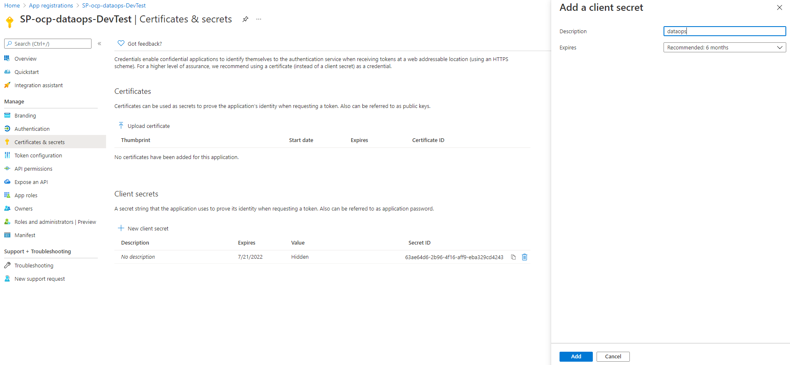
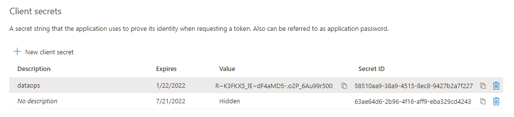
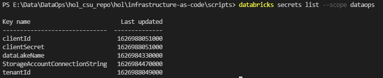

# Create Databricks secrets scope

## Infrastructure Pipeline

After completing the [Preparing your Azure DevOps project](./3-azdo-setup.md) step, make sure the CI/CD pipelines exists in Azure Devops.

>**Note**: `dataops` word as part of the name is the alias that you assign to the project.


## Databricks Secrets Scope

Then, run the PowerShell script located at `infrastructure-as-code/scripts` to create the Databricks secrets scope for **each environment**:

>**Note**: To get `$clientSecret` it is necessary to create a second client secret in the services principal (the first was used in the service connection configuration in the project in DevOps), it could be used for all environments.



>**Note**: Remember copy it because only is showen one time.




```
$clientSecret = ConvertTo-SecureString -AsPlainText

./DatabricksSecrets.ps1 `
  -ClientID "<client_id>" `
  -ClientSecret $clientSecret `
  -DataResourceGroup "<data_resource_group_name>" `
  -ComputeResourceGroup "<compute_resource_group_name>" `
  -KeyVaultName "<kv_name>" `
  -DataLakeName "<adls_name>" `
  -DatabricksName "<databricks_name>"
```
>**Note**: To see Key names in secret scope dataops execute the follow command.

```
databricks secrets list --scope dataops
```

